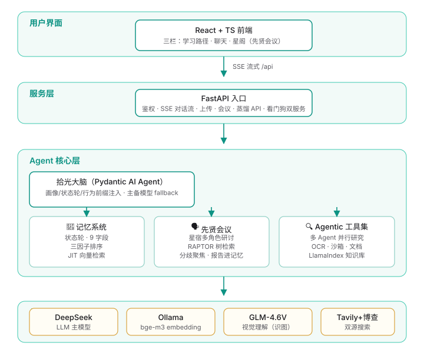

<div align="center">
  
  <h1>拾光 · Lumen</h1>
  <p><b>本地优先的 AI 成长搭子</b> —— 记得你、理解你、敢挑战你的学习伙伴</p>
  <p><i>北极星（v2.0）：让你<u>愿意回来</u>，回来时<u>一起学</u></i></p>
  <p>
    <a href="#-它是什么">它是什么</a> ·
    <a href="#-核心能力">核心能力</a> ·
    <a href="#-技术栈">技术栈</a> ·
    <a href="#-架构">架构</a> ·
    <a href="#-快速开始">快速开始</a> ·
    <a href="#-评测与方法论">评测</a> ·
    <a href="#-隐私与安全">隐私</a>
  </p>
</div>

---

## 🎯 它是什么

拾光是一个 **Agentic 架构的本地 AI 学习应用**：FastAPI 后端 + Pydantic AI 单 Agent（29 工具）+ React 前端，
所有个人数据落在本机。它解决一个具体痛点——**学习工具记不住你**。

「你已经学到哪、上次卡在哪、你怎么学最快」，模型本身不知道。拾光用**分层记忆 + 工具化能力 + 多 Agent 研讨**
让 AI 真正记得你，并且**敢挑战你**（对事不对人；语义判断归模型，确定性不变量归代码）。

| 是 | 不是 |
|---|---|
| 记得你、会主动挑战你的**成长搭子** | 又一个通用聊天机器人 |
| 本地优先、数据不出机的**个人应用** | 需要注册上云的 SaaS |
| 单 Agent + 工具 + 记忆的**工程化 Agent 系统** | 论文 Demo / 玩具原型 |
| 可审计、可回滚的**记忆系统** | 黑盒「个性化推荐」 |

---

## ✨ 核心能力

| 能力 | 机制 | 关键实现 |
|---|---|---|
| **三层记忆** | 状态轮（工作记忆）+ 长期结构化条目 + JIT 向量检索 | 10 类词汇表归一 · 四原语治理（ADD/UPDATE/DELETE/NOOP） |
| **向量检索排序** | 三因子加权打分 | 相关性 0.7 / 重要度 0.15 / 新鲜度 0.15（对照实验选定） |
| **会话收尾提炼** | 会话结束时把对话压缩成结构化记忆 | 9 路提炼器（画像/困惑/闪光/关系/延续/教学/主题/策略/类比） |
| **先贤会议** | 多星宿角色研讨 + 工具化检索书籍证据 | 4 种模式 · RAPTOR 层级树 · SSE 流式 |
| **多模态** | 识图 + 生图 + OCR 三级互补 | GLM-4.6V-Flash（识图）· CogView-3-Flash（生图）· RapidOCR（读字） |
| **并行研究** | 主 Agent 拆目标 → 子 Agent 并行检索 | `asyncio.gather` · 双搜索源路由（国际源 + 中文源） |
| **长任务 harness** | 多步计划落盘，进度只能凭证据推进 | `plan.json` 四工具 · 证据三档核验 |
| **反向教学** | AI 当学生、用户当老师 | `teach_back`：暴露「以为会了」的漏洞 |
| **跨域类比** | 把新概念映射到你已懂的领域 | 独立提炼器，反思层产出、按需检索 |
| **接地纠错** | 工具失败进台账，重复失败升级处理 | 循环检测 · n=3 升级 · n=5 硬停止 |
| **主动服务** | 模型提议注册提醒，代码校验后执行 | `manage_wakeup` · 护栏（时间窗 / 条数上限 / 去重） |
| **多用户** | 每个账号独立数据目录与记忆 | argon2id 密码哈希 + JWT 会话 |

### 🧠 记忆系统细节

- **状态轮**：每轮注入当前状态（情绪 / 卡点 / 节奏 / 意愿），注入标注「疑似」边界——**数据给觉察，不给判断**
- **人可审计**：记忆是纯文本事实行，人可读、可修正、可删除、可 git 回滚
- **JIT 检索**：不常驻上下文，需要时才查——省 token 且避免「记忆污染注意力」
- **本地嵌入**：bge-m3 走 Ollama HTTP 单实例，规避多进程抢显存导致的问题

### 🗣️ 先贤会议（Multi-Agent Debate）

| 模式 | 名称 | 参会星宿 | 轮数 |
|---|---|---|---|
| `cross` | 跨领域圆桌 | 影响力 × 贫穷的本质 × 笛卡尔 | 2 |
| `spectrum` | 观点光谱 | 立场差异最大的组合铺开交锋 | 3 |
| `review` | 实战评审 | 各领域星宿评审你的方案 | 2 |
| `deep` | 同源深挖 | 笛卡尔（理性演绎）× 培根（经验归纳） | 3 |

会议中星宿会**自主检索 RAPTOR 树**作为「书中证据」发言，而非凭空生成。

---

## 🧰 技术栈

| 层 | 选型 | 版本 | 选型理由 |
|---|---|---|---|
| 后端框架 | FastAPI + Uvicorn | 0.141 / 0.52 | 原生 async，SSE 流式天然适配 |
| Agent 底座 | **Pydantic AI** | 2.27 | 类型安全优先；对比评估 LangChain / LangGraph 后选型 |
| 主模型 | DeepSeek | v4-flash | 国内直连、function calling 稳定、成本可控 |
| 向量库 | ChromaDB | 1.5 | 单机零运维，cosine 空间显式指定 |
| 嵌入模型 | bge-m3（Ollama 服务化） | Q8_0 | 单 GPU 实例根治并发抢显存 |
| 前端 | React + TypeScript + Vite | 19 / 6.x / 8.x | 类型安全 + 构建快 |
| 样式 | Tailwind CSS | 4.x | 原子化，配合 design token |
| 状态管理 | Zustand | 5.x | 轻量，无样板代码 |
| 渲染 | react-markdown + Mermaid | — | 公式 / 图表 / 代码块原生支持 |
| 数据库 | SQLite（WAL） | — | 单机个人应用，零运维 + 并发读友好 |
| 沙箱 | RestrictedPython + 子进程隔离 | 8.4 | 语言约束 + 进程隔离 + 内存墙 |
| 账号 | argon2id + JWT | — | 密码哈希与令牌分离 |

---

## 🏗️ 架构



| 模块 | 职责 | 关键文件 |
|---|---|---|
| `app/routers/` | HTTP 入口层（**按域拆分**：chat / memory / kb / learning / me / auth / 观测 / 面板） | `chat.py` `memory.py` `learning.py` |
| `app/agent/` | 搭子大脑：静态 Prompt + 动态上下文装配、模型 fallback 链、会话压缩、接地纠错、类比、验证器 | `tutor.py` `context_strategy.py` `error_loop.py` |
| `app/memory/` | 记忆 schema（字段与词汇表）/ store（四原语）/ vector（嵌入 + 检索）/ 生命周期 | `store.py` `vector.py` `lifecycle.py` |
| `app/council/` | 先贤会议引擎、星宿注册表、RAPTOR 树、蒸馏管线、模式预设 | `engine.py` `registry.py` `raptor.py` |
| `app/tools/` | 工具实现：检索 / 沙箱 / 文档 / 知识库 / 视觉 / OCR / 生图 / 计划 | `sandbox.py` `kb.py` `plan.py` |
| `app/db/` | 会话、提醒投递、多用户 | `sessions.py` `wakeups.py` `users.py` |
| `app/utils/` | 横切工具：原子写、清理守卫 | `atomic_io.py` `safe_cleanup.py` |
| `app/prompts/` | Prompt 外置为 YAML（可审计、字节稳定注入） | `static_prompt.yaml` `extractors.yaml` |
| `frontend/` | React 前端（44 组件）：对话流 / 记忆抽屉 / 学习路径 / 星图 / 设置 | `src/components/` |
| `scripts/` | 评测设施与运维脚本：回归门、验证套件、看门狗、基准 | `verify_all.py` `service_guard.py` |

### 工程实践

| 实践 | 做法 |
|---|---|
| **Prompt 即数据** | 行为前缀外置 YAML，system prompt 字节稳定 → 命中上下文缓存 |
| **动态上下文后置** | 动态内容拼到 user 消息尾部，system 只放静态，最大化缓存前缀 |
| **容错链** | 主 → 备模型 fallback · 超时重试 · 熔断 · 单点失败降级不中断 |
| **可观测** | token 成本台账 · 注入日志 · 工具调用 trace · 失败落盘 |
| **自愈** | 看门狗同时看守 uvicorn 与 Ollama · TCP 单例锁防进程繁殖 |
| **静态检查** | pre-commit 门禁：语法 / ruff / tsc / oxlint |
| **测试** | 898 个 pytest 用例（单元 + 集成 + 安全专项） |

---

## 🚀 快速开始

### 依赖

| 项 | 要求 |
|---|---|
| Python | **3.12+**（开发环境 3.13） |
| Node.js | 18+ |
| Ollama | 本地嵌入服务（必装，非可选） |
| 显存 | 无硬性要求（嵌入走 Ollama，可用 CPU） |

### 启动

```bat
:: ① 配置
copy .env.example .env          :: 至少填 DEEPSEEK_API_KEY
ollama pull bge-m3              :: 拉取嵌入模型

:: ② 安装前端依赖
cd frontend && npm install && cd ..

:: ③ 一键启动（自动 build 前端 + 拉起 Ollama + 后端 + 看门狗）
start.bat

:: ④ 浏览器打开
::    http://127.0.0.1:8000
```

开发模式（热重载，双服务器）：

```bat
start-dev.bat                   :: 后端 8000（--reload）+ 前端 5173（Vite HMR）
```

### 环境变量（`.env`）

| 变量 | 必填 | 默认 | 说明 |
|---|---|---|---|
| `DEEPSEEK_API_KEY` | ✅ | — | 主模型密钥 |
| `DEEPSEEK_MODEL` | — | `deepseek-v4-flash` | 主模型名 |
| `DEEPSEEK_BASE_URL` | — | 官方端点 | 兼容其他 OpenAI 协议服务 |
| `SHIGUANG_TOKEN` | ⚠️ | 空 = 本地免鉴权 | 监听 `0.0.0.0` 时**必须**配置，否则拒绝启动 |
| `ZHIPU_API_KEY` | — | — | 识图 / 生图（免费额度） |
| `TAVILY_API_KEY` | — | — | 联网搜索 · 国际源（免费 1000 次/月） |
| `BOCHA_API_KEY` | — | — | 联网搜索 · 中文源（免费 2000 次） |
| `FALLBACK_*` | — | — | 备用模型端点，主模型故障时切换 |
| `DATA_DIR` | — | 项目根 | 数据目录（隔离多实例运行） |
| `EXPERIMENT_MODE` | — | `0` | `1` 时关闭真实世界副作用（实验实例用） |
| `OLLAMA_EXE` | — | 自动探测 | Ollama 可执行文件路径 |

---

## 🧪 评测与方法论

自建 LLM 模拟用户自动化评测体系，定位是**智能模糊测试**（发现系统怎么坏），不是用户行为预测器。

### 三层验证结构

| 层 | 手段 | 回答的问题 | 不可替代的原因 |
|---|---|---|---|
| ① 自动化 | LLM 模拟用户 + 场景集 + 重复采样 | 系统在边界上怎么坏 | 成本低、可复现、能压测 |
| ② 开发者自用 | dogfooding | 真实使用中有没有价值 | 模拟用户不产生真实需求 |
| ③ 长期真实用户 | 留存观察 | 是否愿意回来 | 前两层无法预测留存 |

### 实测结果

| 指标 | 结果 | 口径 |
|---|---|---|
| 验收场景回归 | **20 场景 × 3 次（pass^3）通过率 100%** | 每场景重复 3 次全过才算通过 |
| 跨会话记忆召回 | **18 / 20** | 20 个跨会话事实探测点；失败项已定位到写入侧 |
| 未记录项不虚构 | **5 / 5** | 含诱导式提问；能区分「没记录」与「不该记」 |
| 长会话空响应率 | **60% → 0** | 480 次复测未复现 |
| 并发响应 P95 | **18.9s → 7.1s（−62.6%）** | n=40 并发压测；串行 vs 并行调度 |
| 上下文缓存命中 | **88% – 97%** | 静态/动态上下文分离后 |
| 总成本 | **−69%** | 按官方 API 定价计（输入侧降 92.3%） |

### 方法论要点

- **行为采样器**：模拟用户按真实分布掷骰，而非使用 LLM 默认行为（避免把模型习惯当成用户习惯）
- **pass^k 而非单次通过**：单次通过可能是运气，重复 k 次全过才算稳定
- **指标要抗辩解**：不用「满意度」类主观指标衡量学习效果（可能是反向指标），看可观察行为量
- **微随机试验（MRT）**：需要判断某个干预是否有效时，用随机化装置 + 序贯分析，而不是事后归因

> 验收用例集与完整测试文档不在本仓库（保持仓库轻量），此处仅列出可复算的结论与口径。

---

## 📁 项目结构

```
app/            后端：入口层 routers/ + Agent + 记忆 + 会议 + 工具 + 数据层
  routers/      HTTP 入口（chat / memory / kb / learning / me / auth / 观测 / 面板）
  agent/        搭子大脑与上下文策略
  council/      先贤会议与星宿
  memory/       记忆 schema / 存储 / 向量检索 / 生命周期
  tools/        工具实现
  prompts/      Prompt 外置 YAML
frontend/       前端（React + TS + Vite + Tailwind）
  src/components/  对话流 / 记忆 / 学习路径 / 星图 / 设置
scripts/        评测设施与运维脚本（回归套件 / 看门狗 / 基准）
scenarios/      评测场景集
assets/         品牌资源
```

---

## 🔒 隐私与安全

| 数据 | 存放位置 | 是否离开本机 |
|---|---|---|
| API 密钥 | `.env`（git 忽略） | 否 |
| 个人记忆 | `memory/`（git 忽略） | 否 |
| 会话与运行时数据 | `data/`（git 忽略） | 否 |
| 对话内容 | 本机 → 所配置的 LLM API | 仅发往你自己配置的模型服务商 |

| 安全实践 | 说明 |
|---|---|
| **默认只监听本机** | 绑定 `127.0.0.1`，不对外暴露 |
| **0.0.0.0 强制门锁** | 监听全网卡时 `SHIGUANG_TOKEN` 未配置则**拒绝启动**（不静默降级） |
| **多用户隔离** | 每账号独立数据目录，密码 argon2id 哈希，JWT 会话 |
| **路径穿越防护** | 文件读取白名单 + 前缀匹配校验 |
| **提交前隐私门** | pre-commit 扫描真实路径 / 密钥 / 内网地址 / 实名，命中即拒绝提交 |
| **数据不出机** | 无遥测、无第三方分析、无云端同步 |

---

## 📄 License

MIT
