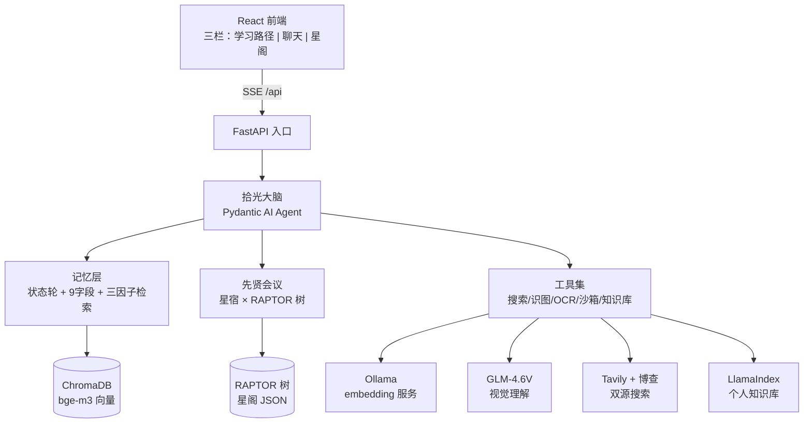

<div align="center">
  
  <h1>拾光 · Lumen</h1>
  <p><b>本地优先的 AI 成长搭子</b> —— 记得你、理解你、敢挑战你的学习伙伴</p>
  <p>
    <i>北极星（v2.0）：让你<u>愿意回来</u>，回来时<u>一起学</u></i>
  </p>
  <p>
    <a href="#核心特色">核心特色</a> ·
    <a href="#架构">架构</a> ·
    <a href="#快速开始">快速开始</a> ·
    <a href="#评测与方法论">评测</a> ·
    <a href="#隐私承诺">隐私</a>
  </p>
</div>

---

## 🚀 Overview

拾光（Lumen）是一个 **Agentic 架构的本地 AI 学习应用**：FastAPI 后端 + Pydantic AI 多 Agent + React 前端。它不是又一个聊天机器人，而是解决一个具体痛点——**学习工具记不住你**：

> 你学到哪了？上次卡在哪？你怎么学最快？AI 模型本身不知道这些——拾光用 **记忆系统 + 多 Agent 编排 + 多模态理解** 让 AI 真正"记得你"，并且**敢挑战你**（对事不对人，判断归模型）。

所有个人数据本地存储，不上传。北极星只有一个：**让你愿意回来，回来时一起学**——它是成长搭子（companion），不是学习工具（tool）。

## ✨ 核心特色

### 🧠 记忆系统 —— 真正"记得你"（三层记忆 + 向量检索）
- **状态轮（工作记忆）**：每轮注入当前状态（情绪/卡点/节奏/意愿），注入标注"疑似"边界——**数据给觉察，不给判断**
- **长期记忆**：9 字段结构化条目 + 四原语治理（ADD/UPDATE/DELETE/NOOP），类别词汇表归一
- **JIT 向量检索**：bge-m3 嵌入 + ChromaDB + 三因子排序（相关性 0.7 / 重要度 0.15 / 新鲜度 0.15，实验验证最优）
- **人可审计**：记忆文件 git 可回滚、界面可修正删除——记忆不是黑盒

### 🗣️ 先贤会议 —— 多视角深度研讨（Multi-Agent Debate）
- **星宿（Sage）多角色研讨**：笛卡尔理性演绎 × 培根经验归纳（deep 模式）等多组合，分歧聚焦
- **RAPTOR 树**：把原书递归聚类摘要成层级树，星宿发言时**自主检索树作为"书中证据"**（工具化调用，实测调用率 100%）
- SSE 流式会议引擎、停止四层参数、报告进记忆

### 👁️ 多模态理解 —— 拍照问错题
- **GLM-4.6V-Flash**（免费视觉模型，128K 上下文）：图表趋势、几何题、错题、笔记
- 与本地 OCR（RapidOCR）互补：OCR 读字 / 视觉理解看图，双模型降级链
- 上传图片 → 拾光自主调视觉工具 + 结合记忆回答

### 🔍 Agentic Search —— 多 Agent 并行研究
- `deleg_study`：主 Agent 拆解目标 → 2-5 个子 Agent **并行**搜索研究（asyncio.gather，单失败不中断）
- **双搜索源路由**：Tavily（国际源）+ 博查（中文源，DeepSeek 官方同款引擎），按语义选源
- **按需触发**：闲聊/通用知识零搜索，需要最新信息才搜（实测验证克制性）

### 🤝 成长搭子 —— 挑战与接住
- 行为原则（罗盘写法）：可以质疑/反驳你，对事不对人，**分寸判断权在模型**
- 不设墙：语义判断归模型（判断无墙），确定性不变量锁代码（不变量无口）

### 🧪 自建评测体系 —— 不是"已验证"，是"可验证"
- LLM 模拟用户（3 类 persona）+ 场景集（复习/压力面试/长马拉松），定位**智能模糊测试**（发现系统怎么坏）
- 实测产出：**160 轮马拉松 0 字塌方**（修复前 66 轮起塌方）；画像层串扰实证；行为漂移治理

## 🏗️ 架构



| 模块 | 说明 |
|---|---|
| `agent/` | 拾光大脑（MINIMAL_PROMPT + 行为前缀 + 画像/状态注入）、多 Agent 并行研究、LLM fallback 链 |
| `council/` | 先贤会议引擎、星宿 Agent、RAPTOR 树、蒸馏管线、模式预设 |
| `memory/` | 记忆 schema（9 字段）/ store（四原语）/ vector（bge-m3 + ChromaDB） |
| `tools/` | 双源搜索、视觉理解、OCR、Python 沙箱、文档读取、知识库、调度器 |
| `prompts/` | Prompt 外置（YAML 可审计，字节稳定注入） |
| `scripts/` | 评测设施（模拟用户 / 回归套件 / 验证脚本） |

### 工程实践
- **Prompt 即数据**：行为前缀外置 YAML，字节稳定注入（Context Caching 友好）
- **容错链**：主→备模型 fallback、120s 硬超时、熔断、单点失败降级不中断
- **可观测性**：成本台账（token_usage）、注入日志、会议工具调用率、失败日志落盘
- **自愈**：看门狗双服务（uvicorn + Ollama），单例锁防多代残留

## 🚀 快速开始

### 依赖
- Python 3.12+、Node.js 18+
- **Ollama**（本地 embedding 服务）：https://ollama.com 下载 → `ollama pull bge-m3`
  （或 ModelScope 下 bge-m3 GGUF 导入；`OLLAMA_MODELS` 可指定模型盘符）

### 启动
```bat
:: ① 配置
copy .env.example .env   :: 填 DEEPSEEK_API_KEY（必填）；TAVILY/BOCHA/ZHIPU 可选增强
cd frontend && npm install && cd ..

:: ② 一键启动（自动 build 前端 + 拉起 Ollama + 后端 + 看门狗）
start.bat

:: ③ 浏览器打开 http://127.0.0.1:8000
```

### 环境变量（.env）
| 变量 | 必填 | 说明 |
|---|---|---|
| `DEEPSEEK_API_KEY` | ✅ | 主模型（deepseek-v4-flash） |
| `TAVILY_API_KEY` | | 联网搜索-国际源（免费 1000/月） |
| `BOCHA_API_KEY` | | 联网搜索-中文源（免费 2000 次） |
| `ZHIPU_API_KEY` | | 识图（GLM-4.6V-Flash 免费） |
| `SHIGUANG_TOKEN` | | 鉴权（局域网/公网必配） |
| `FALLBACK_*` | | 备用模型（fallback 链） |

## 🧪 评测与方法论

自建 LLM 模拟用户自动化评测体系——定位是**智能模糊测试**（发现系统怎么坏），不是用户预测器：

- **3 类典型学习者 persona**（备考冲刺/碎片学习/深度钻研）+ 行为采样器（按真实分布掷骰，非 LLM 默认行为）
- **三层验证结构**：① AI 模拟抓边界 ② 开发者真实使用判价值（dogfooding）③ 长期真实用户判留存——每层不互相替代
- **主要产出**：160 轮马拉松 0 字塌方（修复前 66 轮起塌方）；画像层串扰实证；模拟用户行为漂移治理；16 场景回归套件基线 48/48

## 📁 项目结构

```
app/            后端（FastAPI + Agent + 记忆 + 会议 + 工具）
frontend/       前端（React + TS + Vite + Tailwind）
scripts/        评测设施与工具脚本
scenarios/      评测场景集
memory/         用户记忆（运行时生成，git 忽略——隐私）
data/           运行时数据（SQLite/向量/上传，git 忽略——隐私）
assets/         品牌资源（Logo）
```

## 🔒 隐私承诺

- `.env`（API 密钥）、`memory/`（个人记忆）、`data/`（运行时数据）**全部 git 忽略，绝不上传**
- 所有数据本地存储；记忆文件人可审、可导出、可删除

## 📄 License

MIT
